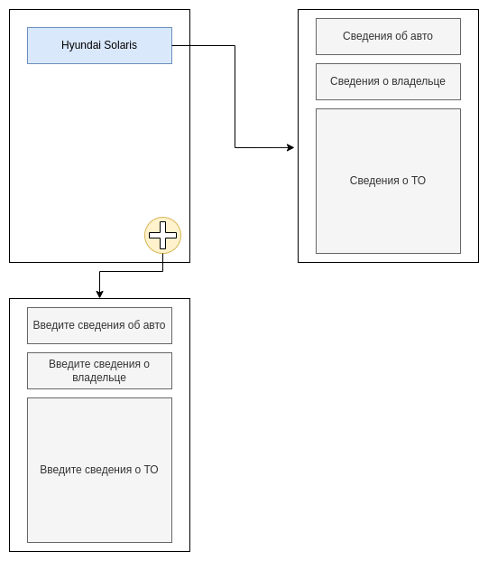

# InfoBook App

### Описание

Мобильное приложение: электронная сервисная книжка для автомобиля

### Требования заказчика

- Сведения об автомобиле
- Сведения о собственнике
- Список предыдущих ТО
    - Возможность добавлять в список записи о ТО
    - При нажатии на элемент списка отображается подробная информация

### Примерная архитектура

Используем Kotlin

#### Компоненты
1. Список автомобилей
2. Окно регистрации
3. Основное окно приложения
4. БД для хранения данных

### План работы

- Создать Github репозиторий
- Продумать архитектуру
- Разработка приложения в порядке 1, 2, 3, 4

### Схема приложения

